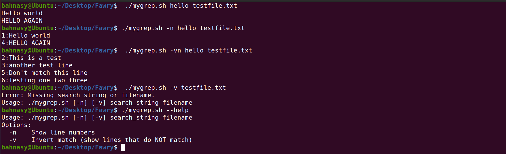
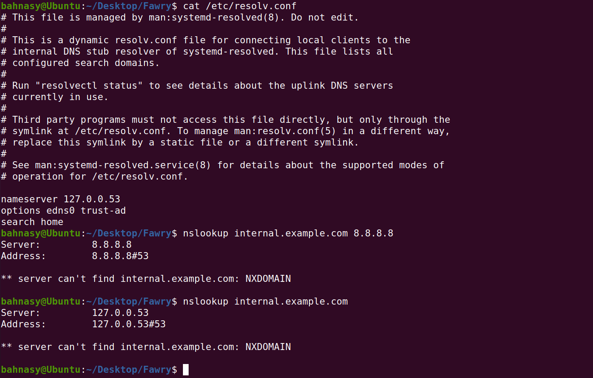
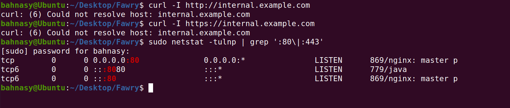

# 🛠️ Fawry Internship Task


## 📂 Task 1: Custom Command (`mygrep.sh`)

### 📜 Description:
Build a small version of `grep` using a Bash script.

- **Search for a string (case-insensitive)**
- **Options supported:**
  - `-n` → Show line numbers
  - `-v` → Invert match (show lines that **do not** match)
  - Combined options like `-vn` or `-nv` must work
- **Error handling** for missing arguments or wrong usage
- **Optional:** `--help` flag support and use of `getopts`

---

### 🔥 Test Cases Required:

- `./mygrep.sh hello testfile.txt`
- `./mygrep.sh -n hello testfile.txt`
- `./mygrep.sh -vn hello testfile.txt`
- `./mygrep.sh -v testfile.txt` (should warn: missing search string)

---

### 🖼️ Screenshot:



---

### 🧠 Reflective Section:

**How the script handles arguments and options:**
- It first checks if enough arguments are passed.
- If the first argument starts with `-`, it parses options.
- The script supports single and combined options like `-v`, `-n`, and `-vn`.
- If missing arguments or wrong usage, it shows a help message.

---

**How would the structure change if regex or more options (-i/-c/-l) are supported?**
- Use `getopts` instead of manual parsing.
- Add regular expression support inside the matching logic.
- Support other options by setting flags and adjusting behavior based on those flags.

---

**Hardest part:**
- Handling combined options like `-vn` correctly without breaking simpler cases was the most challenging part.

---

## 📂 Task 2: DNS/Network Troubleshooting

### 📜 Situation:
Internal service `internal.example.com` is unreachable. Users get “host not found” errors.

---

### 🛠️ Steps Taken:

#### 1. Verify DNS Resolution:

- Check current DNS configuration:
```bash
cat /etc/resolv.conf
nslookup internal.example.com
```

- Test with public DNS (8.8.8.8):
```bash
nslookup internal.example.com 8.8.8.8
```

---

### 🖼️ Screenshot:



---

#### 2. Diagnose Service Reachability:

- Test if the service is reachable via HTTP/HTTPS:
```bash
curl -I http://internal.example.com
curl -I https://internal.example.com

```


- Check if the service is listening on the server:
```bash
sudo netstat -tulnp | grep ':80\|:443'
```


---

#### 3. Possible Causes and Fixes:

**Possible Causes:**

- **DNS Issues:**
  - Wrong DNS server
  - Missing or incorrect A record
  - Local DNS caching issues

- **Network Issues:**
  - Firewall blocking required ports
  - Routing problems or subnet blocking

- **Service Issues:**
  - Service not listening on correct IP or port
  - Service crashed or misconfigured

- **System Configuration Issues:**
  - Incorrect `/etc/hosts` entries
  - Local DNS resolver misbehaving

---

**How to Confirm and Fix:**

- **DNS Issue:**
  - Confirm with `dig`, `nslookup`
  - Fix by editing `/etc/resolv.conf` or DNS server settings

- **Network Issue:**
  - Confirm with `telnet`, `nc`
  - Fix by allowing ports using firewall rules, e.g., `sudo ufw allow 80,443`

- **Service Issue:**
  - Confirm with `netstat`, `ss`
  - Fix by restarting the service, checking configs

- **System Configuration Issue:**
  - Confirm by checking `/etc/hosts`, and flushing DNS cache
  - Fix `/etc/hosts` or restart `systemd-resolved`

---

#### 🛠️ Commands for Fixing:

- Edit `/etc/resolv.conf`:
```bash
sudo nano /etc/resolv.conf
```

- Add manual entry to `/etc/hosts`:
```bash
sudo nano /etc/hosts
# Example:
192.168.1.10 internal.example.com
```

- Open firewall ports:
```bash
sudo ufw allow 80
sudo ufw allow 443
sudo ufw reload
```

- Restart services:
```bash
sudo systemctl restart nginx
# or
sudo systemctl restart apache2
```

- Persist DNS settings using `systemd-resolved`:
```bash
sudo nano /etc/systemd/resolved.conf
# Set DNS=8.8.8.8
sudo systemctl restart systemd-resolved
```

Or with NetworkManager:
```bash
nmcli connection modify <connection_name> ipv4.dns "8.8.8.8 1.1.1.1"
nmcli connection up <connection_name>
```

---


